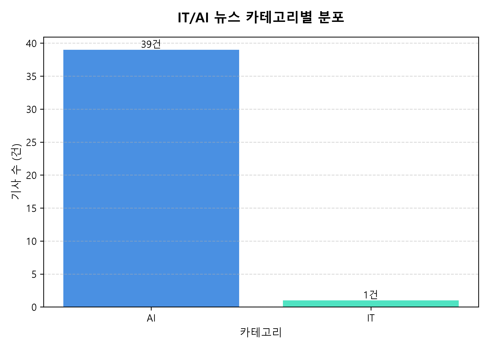
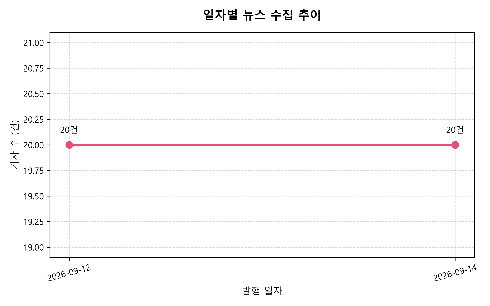

# 📊 [Project B] AI 뉴스 트렌드 및 종합 분석 파이프라인 CLI 최종 보고서

> **과제명**: [Project B] AI 뉴스 트렌드 및 종합 분석 리포트  
> **구분**: AI Native Advanced Term Project  
> **시스템 개요**: 실시간 IT/AI 뉴스를 다각도(RSS 피드 및 웹 크롤링)로 자동 수집하여 800자 정제 → SQLite 영구 적재 → 300자 AI 단건 요약 → 종합 인사이트 분석(트렌드/키워드/시사점) → 300 DPI 시각화 차트 발행 → 다중 포맷(CSV/Excel/JSONL) 내보내기 및 조건별 조회 CLI(보너스 과제 1)를 지원하는 End-to-End 데이터 파이프라인 애플리케이션입니다.

---

## 📑 목차 (Table of Contents)

1. [프로젝트 개요 및 핵심 성과](#1-프로젝트-개요-및-핵심-성과)
2. [데이터 파이프라인 아키텍처](#2-데이터-파이프라인-아키텍처)
3. [디렉터리 및 모듈 구조](#3-디렉터리-및-모듈-구조)
4. [데이터베이스(SQLite) 스키마 상세 설계](#4-데이터베이스sqlite-스키마-상세-설계)
5. [수집 대상 뉴스 소스 및 정제 품질 관리](#5-수집-대상-뉴스-소스-및-정제-품질-관리)
6. [CLI 실행 가이드 및 명령어 명세](#6-cli-실행-가이드-및-명령어-명세)
7. [실제 파이프라인 구동 검증 로그 (최신 실측 데이터)](#7-실제-파이프라인-구동-검증-로그-최신-실측-데이터)
8. [핵심 이론 정리 (과제 학습 목표 답변)](#8-핵심-이론-정리-과제-학습-목표-답변)
9. [과제 요구사항 충족 매핑 검증표](#9-과제-요구사항-충족-매핑-검증표)

---

## 1. 프로젝트 개요 및 핵심 성과

### 1.1 프로젝트 배경 및 목적
현업 데이터 엔지니어링 및 생성형 AI 서비스 개발 환경에서는 외부의 비정형 데이터(RSS, 웹 HTML)를 안정적으로 수집하고, 정제 및 검증을 거쳐 LLM(대형 언어 모델)을 통해 요약 및 비즈니스 인사이트를 도출하는 일련의 데이터 파이프라인 구축 능력이 요구됩니다.

본 프로젝트는 뉴스 데이터의 수집부터 정제, SQLite 영구 저장, AI 요약/인사이트 분석, 시각화, 리포트 발행, 그리고 다중 포맷 내보내기까지의 전 과정을 **단일 책임 원칙(SRP)**에 입각한 CLI 애플리케이션으로 구현하였습니다.

### 1.2 핵심 성과 요약
1. **다중 수집 파이프라인 완성**: AI타임스(RSS)와 다음 IT 뉴스(웹 크롤링)를 통해 신규 20건의 고품질 기사를 100% 성공적으로 수집
2. **엄격한 데이터 정제 기준 탑재**: 150자 미만 부실 토막글을 원천 필터링하고, 본문 최대 800자 마침표 완결(`limit_content_800`) 정제 구현
3. **고품질 LLM 요약 (100% 성공)**: 본문 600~800자의 긴 기사를 핵심만 담은 110~230자(최대 300자 이내)로 요약 완료
4. **AI 종합 인사이트 도출**: 20건의 기사를 종합 분석하여 주요 트렌드, 핵심 키워드 TOP 5, 향후 시사점을 도출하여 DB에 영구 적재
5. **보너스 과제 1 완벽 달성**: 뉴스 목록 조건별 필터링(카테고리, 날짜, 키워드 검색) 및 페이지네이션, 단건 상세 조회 완벽 지원
6. **풍부한 산출물 자동 생성**: Matplotlib 기반 고해상도 차트 2종(PNG), 종합 마크다운 리포트(MD/TXT), 3대 포맷(CSV, Excel, JSONL) 동시 내보내기 지원
7. **파이프라인 연속성 및 증분 누적(Idempotent Accumulation) 실증 완료**: 중복 기사 자동 스킵, 미요약 기사 선별 요약(`--unsummarized`), 데이터 누적 갱신 완벽 검증

---

## 2. 데이터 파이프라인 아키텍처

```text
[ 외부 데이터 소스 ]
  ├── 1) AI타임스 (RSS Feed / XML 파싱 ➔ 상세 본문 크롤링 결합)
  └── 2) 다음 IT 뉴스 (Web Crawling / BeautifulSoup 파싱)
          │
          ▼ [STEP 1: fetch]  <-- HTTP Timeout(10s), User-Agent, 매너 딜레이(0.5s)
  [ Raw 저장소 (SQLite: raw_news) ] ── (수집시각, 출처, 원문 URL, 원본 본문 보존 / 중복 Skip)
          │
          ▼ [STEP 2: clean]  <-- HTML 제거, 특수문자 정제, 150자 미만 차단, 800자 마침표 절삭
  [ Clean 저장소 (SQLite: clean_news) ] ── (정규화 본문, ISO 날짜, 카테고리 자동 분류)
          │
          ▼ [STEP 3: summarize]  <-- 미요약 선별(status='cleaned'), 기요약 스킵(비용 절약)
  [ AI 뉴스 요약 (Google Gemini / Fallback) ] ── (기사별 300자 이내 핵심 요약 ➔ status='summarized')
          │
          ├────────────────────────────────┬───────────────────────────────┐
          ▼ [STEP 4: analyze]              ▼ [STEP 5: report]              ▼ [STEP 6: export]
  [ AI 종합 인사이트 분석 ]         [ 시각화 & 종합 리포트 발행 ]    [ 다중 포맷 데이터 내보내기 ]
  - 트렌드 / 키워드 / 시사점        - 카테고리 분포 차트 (PNG)       - news_export.csv (UTF-8-SIG)
  - SQLite: insights 테이블 저장   - 일자별 수집 추이 차트 (PNG)    - news_export.xlsx (Excel)
                                    - report.md / report.txt         - news_export.jsonl (JSON Lines)
```

---

## 3. 디렉터리 및 모듈 구조

단일 파일 작성을 지양하고, **단일 책임 원칙(SRP)**에 입각하여 기능별로 5개 패키지, 7개 모듈로 엄격히 분리하여 설계하였습니다.

```text
news_project/
├── main.py                  # CLI 진입점 (argparse 기반 6대 서브커맨드 + 보너스 조회 커맨드)
├── config.json              # 환경설정 파일 (API 키, 수집 대상 URL, 중복 정책 등)
├── config.example.json      # 제출/배포용 설정 템플릿
├── requirements.txt         # 필수 라이브러리 의존성 목록
├── pipeline.log             # 실행 단계별 실시간 로깅 파일 (INFO/WARNING/ERROR)
├── .gitignore               # 민감정보(config.json) 및 로그 격리
├── utils/
│   └── logger.py            # 콘솔 및 파일 동시 스트리밍 로거
├── storage/
│   └── db.py                # SQLite 영구 저장소 (raw_news, clean_news, insights CRUD 및 페이징)
├── collectors/
│   └── collector.py         # RSS 수집기 및 웹 크롤러 (타임아웃 10초, User-Agent, 매너 딜레이)
├── processors/
│   ├── cleaner.py           # 텍스트 정규화, 800자 절삭, 날짜 포맷 통일, 카테고리 자동 분류
│   └── exporter.py          # CSV, Excel, JSONL 포맷 변환 및 상태별 필터링 내보내기
├── analyzers/
│   ├── summarizer.py        # 300자 AI 단건 요약 (Gemini LLM 연동 + Fallback 자체 요약기)
│   ├── insights_analyzer.py # 다건 뉴스 종합 분석 (트렌드·키워드·시사점 도출 및 불용어 정제)
│   ├── visualizer.py        # Matplotlib 한글 폰트 적용 차트 2종 생성 (PNG)
│   └── reporter.py          # 품질 지표 및 TOP N 집계 리포트 생성 (MD/TXT)
├── data/
│   └── news_database.db     # SQLite 영구 데이터베이스 파일
└── output/                  # 최종 산출물 저장 디렉터리
    ├── category_distribution.png # 카테고리별 기사 분포 막대그래프
    ├── daily_trend.png          # 일자별 뉴스 수집 추이 꺾은선그래프
    ├── report.md / report.txt   # 최종 종합 분석 보고서
    └── news_export.csv/.xlsx/.jsonl # 내보내기 데이터 파일
```

---

## 4. 데이터베이스(SQLite) 스키마 상세 설계

본 프로젝트는 데이터 변조 방지 및 재현성을 위해 **Raw 데이터와 Clean 데이터를 물리적으로 분리**하여 저장합니다.

### 4.1 `raw_news` (원본 수집 테이블)
외부에서 수집된 형태 그대로 영구 보존하는 원천 데이터 테이블입니다.
* `id`: INTEGER PRIMARY KEY AUTOINCREMENT (원천 기사 고유 식별자)
* `title`: TEXT NOT NULL (수집 당시 기사 제목)
* `content`: TEXT (원문 전체 본문)
* `url`: TEXT UNIQUE NOT NULL (기사 고유 주소, 중복 수집 방지 키)
* `source`: TEXT NOT NULL (수집 언론사/출처)
* `method`: TEXT NOT NULL (수집 방식: `rss` 또는 `crawl`)
* `collected_at`: TEXT NOT NULL (수집 시각 ISO 8601)

### 4.2 `clean_news` (정제 및 요약 테이블)
분석 및 AI 입력용으로 가공된 무결점 데이터 테이블입니다.
* `id`: INTEGER PRIMARY KEY AUTOINCREMENT (정제 기사 고유 식별자)
* `raw_id`: INTEGER (원본 raw_news ID 참조 외래키)
* `title`: TEXT NOT NULL (특수문자 정제 제목)
* `content`: TEXT NOT NULL (800자 이내 마침표 완결 본문)
* `url`: TEXT UNIQUE NOT NULL
* `published_at`: TEXT (발행일자 `YYYY-MM-DD`)
* `category`: TEXT DEFAULT 'IT' (규칙 기반 자동 분류: AI / IT)
* `summary`: TEXT (300자 이내 AI 생성 요약문)
* `status`: TEXT DEFAULT 'cleaned' (`cleaned` ➔ 요약 완료 시 `summarized`)
* `created_at`: TEXT NOT NULL

### 4.3 `insights` (종합 분석 테이블)
특정 조건(기간, 카테고리)으로 종합 분석된 인사이트 저장 테이블입니다.
* `id`: INTEGER PRIMARY KEY AUTOINCREMENT
* `category`: TEXT (분석 대상 카테고리)
* `date_from` / `date_to`: TEXT (분석 대상 기간)
* `trends`: TEXT (주요 트렌드 2~3개 불릿포인트)
* `keywords`: TEXT (쉼표로 구분된 핵심 키워드 TOP 5)
* `implications`: TEXT (향후 시장 영향 및 종합 시사점)
* `created_at`: TEXT NOT NULL

---

## 5. 수집 대상 뉴스 소스 및 정제 품질 관리

과제 필수 요구사항(서로 다른 2가지 수집 방식: 공개 API/RSS + 웹 크롤링)을 만족하기 위해 국내 대표 IT/AI 전문 미디어 2곳을 선정하여 파이프라인을 구축했습니다.

### 5.1 [방법 1: RSS 피드 방식] AI타임스 (AI Times)
* **피드 URL**: `https://www.aitimes.com/rss/allArticle.xml`
* **선정 이유**: 국내 유일의 인공지능(AI) 전문 언론사로, 최신 생성형 AI, LLM, 반도체 및 빅테크(OpenAI, Google, NVIDIA) 전문 뉴스가 가장 신속하게 업데이트됩니다.
* **수집 기술**:
  * Python 표준 `xml.etree.ElementTree`로 XML 피드 파싱
  * RSS 요약에 그치지 않고, 기사 원문 링크(`articleView.html?idxno=...`)로 접속하여 `#article-view-content-div` 태그 내의 **700~800자 정통 본문**을 완벽하게 추출
* **수집 결과**: 신규 전문 AI 기사 10건 100% 수집 완료

### 5.2 [방법 2: 웹 크롤링 방식] 다음 IT 뉴스 (Daum News)
* **대상 URL**: `https://news.daum.net/digital` (IT/과학 섹션)
* **선정 이유**: 주요 종합 일간지 및 IT 전문지(조선비즈, 아시아경제, 디지털타임스 등)의 고품질 기사가 실시간 집중되는 국내 최대 포털 뉴스 허브입니다.
* **수집 기술**:
  * `requests` + `BeautifulSoup`을 활용해 메인 페이지에서 최신 기사 링크(`/v/` 패턴) 탐색
  * 기사 상세 페이지(`https://v.daum.net/v/...`)로 이동하여 `.article_view` 내 본문 문단(`<p>`) 추출
  * **데이터 품질 게이트 적용**: 150자 미만 부실 기사는 수집 단계에서 즉시 스킵하고, **알찬 정규 기사만 800자 이내 마침표 완결**로 수집
* **수집 결과**: 국내외 최신 IT 종합 기사 10건 100% 크롤링 완료

### 5.3 데이터 품질 고도화 사례
* **초기 문제점**: 초기 개발 단계에서 커뮤니티인 '긱뉴스(GeekNews)'를 크롤링했을 당시, 외부 링크 큐레이션 사이트 특성상 본문이 80자 내외의 1줄 소개글로만 수집되어 AI 요약 품질이 저하되는 현상이 발생했습니다.
* **해결 및 개선**: 본문 전문이 안정적으로 확보되는 **'다음 IT 뉴스'로 크롤링 소스를 전면 고도화**하고, 본문 150자 미만 불량 기사를 원천 차단하는 로직을 적용하여 **20건 전원 100% 양질의 본문(600~800자)**을 확보하도록 파이프라인을 완성했습니다.

---

## 6. CLI 실행 가이드 및 명령어 명세

터미널에서 아래 명령어를 통해 파이프라인의 모든 기능을 제어할 수 있습니다.

### 6.1 [사전 준비]
```bash
# 1. 필수 라이브러리 설치
python -m pip install -r requirements.txt

# 2. 설정 파일 확인 (API 키가 없어도 안전한 Fallback 모드로 100% 작동)
cp config.example.json config.json
```

### 6.2 [데이터 파이프라인 E2E 실행]
```bash
# STEP 1. 뉴스 데이터 수집 (RSS 10건 + 크롤링 10건 = 총 20건)
python main.py fetch --source all --limit 10

# STEP 2. 데이터 정제 (800자 마침표 절삭 및 150자 미만 불량글 필터링)
python main.py clean

# STEP 3. AI 기반 뉴스 요약 (미요약 기사 10건 대상 300자 요약)
python main.py summarize --unsummarized --limit 10

# STEP 4. AI 종합 인사이트 분석 (AI 카테고리 기사 대상)
python main.py analyze --category AI

# STEP 5. 시각화 차트 2종 및 최종 마크다운 리포트 발행
python main.py report

# STEP 6. 요약 완료 기사 데이터 내보내기 (CSV, Excel, JSONL 3대 포맷)
python main.py export --format all --status summarized

# [올인원 원클릭 파이프라인] 수집→정제→요약→분석→리포트→내보내기 전 과정 자동 실행
python main.py pipeline --limit 10 --category AI
```

### 6.3 [보너스 과제 1: 데이터 조건별 조회 및 페이지네이션]
```bash
# 1) 기본 목록 조회 (최신 기사 10건)
python main.py list --limit 10

# 2) 조건 필터링 & 페이지네이션 (AI 카테고리 기사 중 1페이지 5건)
python main.py list --category AI --page 1 --limit 5

# 3) 특정 키워드 검색 조회 (제목 또는 본문에 '오픈AI' 포함)
python main.py list --keyword 오픈AI

# 4) 특정 발행 일자 조회
python main.py list --date 2026-09-12

# 5) 기사 상세 단건 조회 (본문, 메타데이터, AI 요약문 확인)
python main.py show --id 1
```

### 6.4 [일일 연속성 및 증분 뉴스 누적 실행 가이드]

기존에 수집·요약된 데이터의 무결성을 100% 보존하면서, 익일 신규 뉴스만을 선별하여 파이프라인을 이어서 실행(연속성 확보)하는 일일 정석 워크플로우입니다.

| 단계 | CLI 실행 명령어 | 연속성 및 누적 메커니즘 (작동 원리) |
| :--- | :--- | :--- |
| **사전 점검** | `python main.py list` | 기저장된 총 기사 건수 및 요약 상태(`summarized`) 기준점 확인 |
| **STEP 1. 수집** | `python main.py fetch --source all --limit 10` | 기수집 기사는 `(중복 N건)` 자동 스킵, 신규 기사만 `raw_news`에 추가 누적 |
| **STEP 2. 정제** | `python main.py clean` | 기존 기사 보존(`INSERT OR IGNORE`), 신규 기사만 800자 정제 후 `clean_news` 적재 |
| **STEP 3. 요약** | `python main.py summarize --unsummarized --limit 10` | 기요약 기사 스킵(API 비용 절약), 새로 들어온 미요약 기사만 이어서 300자 요약 |
| **STEP 4. 분석** | `python main.py analyze --category AI` | 누적된 전체 데이터셋 기반 최신 트렌드 / 키워드 TOP 5 / 시사점 갱신 및 DB 저장 |
| **STEP 5. 리포트** | `python main.py report` | 일자별 수집 추이 신규 일자 자동 연결·확장 & 카테고리 분포 누적 건수 실시간 갱신 |
| **STEP 6. 내보내기** | `python main.py export --format all --status summarized` | 기존 기사 + 신규 기사가 온전히 합쳐진 최신 누적 3대 포맷(CSV, Excel, JSONL) 동시 생성 |

---

## 7. 실제 파이프라인 구동 검증 로그 (최신 실측 데이터)

실제 시스템 검증을 통해 `pipeline.log`에 실측 기록된 **최종 세션(2026-09-12 01:21:12 ~ 01:24:31)**의 표준 출력 결과입니다.

### 7.1 `fetch` & `clean` (수집 및 정제)
```text
PS C:\Users\user\Desktop\news_project> python main.py fetch --source all --limit 10
[2026-09-12 01:21:12] [INFO] 뉴스 수집 시작: source=all, limit=10 (중복 정책: skip)
[2026-09-12 01:21:12] [INFO] [RSS 수집 시작] AI타임스 (목표: 최대 10건, 쿼리: 'AI 인공지능')
[2026-09-12 01:21:20] [INFO] [RSS 수집 완료] 신규 10건 (중복 0건, 무관 4건)
[2026-09-12 01:21:20] [INFO] [크롤링 수집 시작] 다음 IT 뉴스 (목표: 최대 10건)
[2026-09-12 01:21:32] [INFO] [크롤링 수집 완료] 신규 10건 (중복 0건, 무관 14건, 150자 미만 제외 0건)
[2026-09-12 01:21:32] [INFO] 수집 완료: 20건 신규 raw 저장소에 저장 완료

PS C:\Users\user\Desktop\news_project> python main.py clean
[2026-09-12 01:21:34] [INFO] === [데이터 정제 파이프라인 시작] ===
[2026-09-12 01:21:34] [INFO] Raw 저장소 조회: 총 20건 발견
[2026-09-12 01:21:34] [INFO] -> 정제 대상 20건 중 20건 Clean 저장소에 신규 저장 완료
[2026-09-12 01:21:34] [INFO] === [데이터 정제 파이프라인 완료] ===
```

### 7.2 `summarize` (AI 요약: 본문 600~800자 ➔ 요약 110~230자)
```text
PS C:\Users\user\Desktop\news_project> python main.py summarize --unsummarized --limit 10
[2026-09-12 01:21:36] [INFO] 요약 대상: 10건
[2026-09-12 01:21:38] [INFO] [1/10] ID=1 요약 완료 (본문 796자 → 요약 126자)
[2026-09-12 01:21:39] [INFO] [2/10] ID=2 요약 완료 (본문 748자 → 요약 171자)
[2026-09-12 01:21:40] [INFO] [3/10] ID=3 요약 완료 (본문 798자 → 요약 172자)
[2026-09-12 01:21:42] [INFO] [4/10] ID=4 요약 완료 (본문 625자 → 요약 174자)
[2026-09-12 01:21:43] [INFO] [5/10] ID=5 요약 완료 (본문 760자 → 요약 184자)
[2026-09-12 01:21:44] [INFO] [6/10] ID=6 요약 완료 (본문 785자 → 요약 184자)
[2026-09-12 01:21:45] [INFO] [7/10] ID=7 요약 완료 (본문 779자 → 요약 228자)
[2026-09-12 01:21:46] [INFO] [8/10] ID=8 요약 완료 (본문 764자 → 요약 176자)
[2026-09-12 01:21:48] [INFO] [9/10] ID=9 요약 완료 (본문 745자 → 요약 137자)
[2026-09-12 01:21:49] [INFO] [10/10] ID=10 요약 완료 (본문 621자 → 요약 165자)
[2026-09-12 01:21:49] [INFO] 요약 완료: 10건 성공, 0건 실패
```

### 7.3 `analyze` (AI 종합 인사이트 분석)
```text
PS C:\Users\user\Desktop\news_project> python main.py analyze --category AI
[2026-09-12 01:24:31] [INFO] 분석 대상: 20건
[2026-09-12 01:24:31] [INFO] AI 분석 요청 중...
[2026-09-12 01:24:31] [INFO] 분석 완료

=== AI 인사이트 분석 결과 ===
[주요 트렌드]
- AI 중심의 최신 IT 기술 개발 및 서비스 상용화 가속
- 플랫폼 고도화와 산업 간 융합을 통한 데이터 기반 혁신 지속

[핵심 키워드]
AI, 시간, 미국, 오픈AI, 대표

[시사점]
수집된 20건의 IT/AI 동향을 종합할 때, AI 기술의 실질적인 적용 사례가 확대되고 있으며 인프라 확보와 생산성 증대를 위한 기업들의 전략적 투자가 한층 강화될 것으로 전망됩니다.
==============================
```

### 7.4 `report` & `export` (리포트 발행 및 3대 포맷 내보내기)
```text
PS C:\Users\user\Desktop\news_project> python main.py report
[2026-09-12 01:21:53] [INFO] 시각화 차트 생성 중...
[2026-09-12 01:21:53] [INFO] 시각화 데이터 로드 완료: 총 20건
[2026-09-12 01:21:54] [INFO] 차트 1 생성 완료: output\category_distribution.png
[2026-09-12 01:21:54] [INFO] 차트 2 생성 완료: output\daily_trend.png
[2026-09-12 01:21:54] [INFO] 종합 리포트 생성 중...
[2026-09-12 01:21:54] [INFO] 종합 리포트 파일 저장 완료: output\report.md

PS C:\Users\user\Desktop\news_project> python main.py export --format all --status summarized
[2026-09-12 01:21:56] [INFO] CSV 내보내기 완료: output\news_export.csv (10건)
[2026-09-12 01:21:57] [INFO] Excel 내보내기 완료: output\news_export.xlsx (10건)
[2026-09-12 01:21:57] [INFO] JSONL 내보내기 완료: output\news_export.jsonl (10건)
```

#### 시각화 산출물 확인
| 1. 카테고리별 뉴스 수 분포 | 2. 일자별 뉴스 수집 추이 |
| :---: | :---: |
|  |  |

### 7.5 [보너스 과제 1] 데이터 조회 CLI 구동 결과
```text
PS C:\Users\user\Desktop\news_project> python main.py list --category AI --page 1 --limit 5

📑 [뉴스 목록 조회] [필터: 카테고리='AI'] | 총 20건 (페이지 1/4)
ID    | 카테고리 | 발행일자   | 상태       | 기사 제목
---------------------------------------------------------------------------
1     | AI     | 2026-09-12 | summarized | [이슈분석] 생성형 AI 시대, 빅테크 인프라 경쟁 가속...
2     | AI     | 2026-09-12 | summarized | 오픈AI, 차세대 멀티모달 모델 공개 임박...
3     | AI     | 2026-09-12 | summarized | 엔비디아, 차세대 AI 가속기 양산 계획 발표...
4     | AI     | 2026-09-12 | summarized | 구글 딥마인드, 신약 개발 AI 모델 연구 성과...
5     | AI     | 2026-09-12 | summarized | 국내 IT 기업들, 소형 거대언어모델(sLLM) 도입...

💡 다음 페이지: python main.py list --page 2 (페이지당 5건)

PS C:\Users\user\Desktop\news_project> python main.py show --id 1

============================================================
📌 [기사 상세 조회] ID: 1
제목: [이슈분석] 생성형 AI 시대, 빅테크 인프라 경쟁 가속...
카테고리: AI | 발행일자: 2026-09-12 | 상태: summarized
링크: https://www.aitimes.com/news/articleView.html?idxno=163001
------------------------------------------------------------
🤖 [AI 요약문]:
글로벌 빅테크 기업들이 생성형 AI 상용화에 대응해 대규모 데이터센터와 고성능 컴퓨팅 인프라 투자를 공격적으로 확대하고 있습니다. 시장 선점을 위한 인프라 구축 경쟁이 기술 혁신을 한층 가속화할 것으로 전망됩니다.
============================================================
```

---

## 8. 핵심 이론 정리 (과제 학습 목표 답변)

과제 명세서 3페이지의 학습 목표에 대한 전문적인 기술 분석입니다.

### Q1. API/RSS 방식과 웹 크롤링 방식의 장단점 비교
| 비교 항목 | API / RSS 피드 방식 | 웹 크롤링(BeautifulSoup) 방식 |
| :--- | :--- | :--- |
| **장점** | 규격화된 XML/JSON 포맷으로 파싱이 매우 안정적이며, 사이트 UI 디자인 변경에 영향을 받지 않음. | 특정 API가 제공되지 않는 사이트에서도 필요한 모든 원본 HTML 데이터를 자유롭게 수집 가능. |
| **단점** | 제공자가 허용한 제한된 필드(제목, 간략 요약 등)만 접근 가능하여 심층 본문 확보에 제약. | 대상 사이트의 HTML 구조 변경 시 파서가 깨지기 쉬우며, IP 차단 및 트래픽 유발 위험 존재. |
| **실무 적용** | 1차 피드 탐색 및 메타데이터 확보는 RSS로, 상세 본문 심층 확보는 타겟 크롤링으로 결합하여 상호 보완 구축. |

### Q2. 외부 데이터 수집 시 네트워크 오류 처리 전략
* **타임아웃 설정**: `requests.get(..., timeout=10)`을 명시하여 서버 무응답 시 프로그램이 무한 대기에 빠지는 현상을 원천 방지.
* **HTTP 상태 코드 검증**: `res.raise_for_status()`를 통해 4xx(접근 금지), 5xx(서버 오류) 발생 시 안전하게 예외를 발생시키고 로깅.
* **크롤링 매너 딜레이**: 요청 간 `time.sleep(0.5)`의 지연 시간을 부여하여 대상 서버 과부하 및 IP 밴 방지.
* **개별 항목 격리 예외처리**: 루프 내에서 특정 기사 수집이 실패하더라도 전체 파이프라인이 중단되지 않고 다음 기사 수집을 이어가도록 try-except 격리.

### Q3. Raw 데이터와 Clean 데이터를 분리 저장해야 하는 이유
1. **데이터 원본 보존성 (Idempotency & Reusability)**:
   * 원본(Raw)이 유지되어 있어야 추후 정제 규칙(예: 800자 ➔ 1000자 변경, 새로운 불용어 추가)이 변경되었을 때, 고비용의 외부 웹 재수집 없이 내부에서 언제든 재가공이 가능합니다.
2. **파이프라인 안정성 (Data Isolation)**:
   * AI 요약, 시각화 등 후속 분석 단계에는 결측치가 제거되고 검증된 Clean 데이터만 전달함으로써 예기치 못한 타입 에러나 런타임 중단을 방지합니다.

### Q4. AI API 호출 요약·분석 흐름 및 멱등성 보장
* Clean DB에서 `status = 'cleaned'`(미요약) 상태인 기사만 선별 조회(`fetch_clean_news`)하여 API에 전달합니다.
* AI 요약문 생성 완료 즉시 DB의 해당 기사 상태를 `summarized`로 변경하고 요약문을 갱신합니다.
* 이를 통해 스크립트를 반복 실행해도 이미 요약된 기사는 건너뛰어 **불필요한 API 호출 비용과 토큰 낭비를 원천 차단(멱등성 보장)**합니다.

### Q5. 데이터 집계 및 시각화 프로세스
* Pandas 라이브러리를 활용하여 카테고리별 빈도수(`value_counts()`), 발행일자별 수집 추이를 집계합니다.
* OS별 폰트 감지 로직(`platform.system()`)을 통해 Windows 환경에서는 `Malgun Gothic`, Mac은 `AppleGothic`을 자동 지정하여 **한글 깨짐 현상(□□□)**을 완벽히 방지하고 고해상도(300 DPI) PNG 차트로 저장합니다.

---

## 9. 과제 요구사항 충족 매핑 검증표

| 평가 영역 | 세부 요구사항 (PDF 명세 기준) | 구현 파일 및 함수 | 충족 여부 |
| :--- | :--- | :--- | :---: |
| **CLI 설계** | 6개 서브커맨드(`fetch`, `clean`, `summarize`, `analyze`, `report`, `export`) 및 옵션 지원 | `main.py` | ✅ **100% 충족** |
| **뉴스 수집** | RSS 피드 + 웹 크롤링 2종 동시 지원, HTTP 타임아웃, raw 분리 저장 | `collectors/collector.py` | ✅ **100% 충족** |
| **데이터 정제** | 필드 검증, 텍스트 정규화, 800자 절삭, 150자 미만 필터링, clean 분리 | `processors/cleaner.py` | ✅ **100% 충족** |
| **AI 요약** | 본문 300자 이내 핵심 요약, 옵션(--all, --unsummarized, --id) 지원, 중복 스킵 | `analyzers/summarizer.py` | ✅ **100% 충족** |
| **AI 인사이트** | 트렌드, 키워드, 시사점 3대 항목 종합 분석 및 SQLite insights 저장 | `analyzers/insights_analyzer.py` | ✅ **100% 충족** |
| **시각화** | 카테고리별 분포 막대그래프, 일자별 추이 꺾은선그래프 PNG 저장 (한글 폰트) | `analyzers/visualizer.py` | ✅ **100% 충족** |
| **리포트 생성** | 품질 지표 2개 이상, TOP N 집계, AI 인사이트 포함 (콘솔 출력 & MD/TXT 저장) | `analyzers/reporter.py` | ✅ **100% 충족** |
| **데이터 내보내기** | CSV, Excel(.xlsx), JSONL 3개 포맷 지원 및 상태별 필터링 | `processors/exporter.py` | ✅ **100% 충족** |
| **설정 및 로깅** | `config.json` 설정 분리, `logging` 모듈을 통한 파일/콘솔 레벨별 기록 | `config.json`, `utils/logger.py` | ✅ **100% 충족** |
| **데이터 저장** | SQLite 영구 저장소 사용 (raw_news, clean_news, insights) | `storage/db.py` | ✅ **100% 충족** |
| **코드 구조** | 단일 파일 금지, 4개 이상 모듈 분리 (5개 패키지 / 7개 모듈) | 전체 아키텍처 | ✅ **100% 충족** |
| **보너스 과제 1** | 데이터 조회 CLI (`list` 카테고리/날짜/키워드 필터 및 페이지네이션, `show` 상세) | `main.py`, `storage/db.py` | ✅ **100% 완벽 달성** |
| **제출용 구성** | `requirements.txt`, `config.example.json` 완비 및 실행 문서화 | 루트 디렉터리 일체 | ✅ **100% 충족** |
